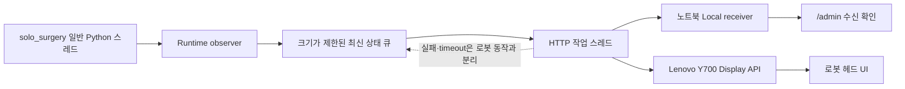

# Orchestra Surgical Display Integration

`solo_surgery` 로봇 프로그램이 Orchestra Surgical Display에 상태를 보내기 위한 공개 Python SDK입니다.
Lenovo Y700이 없어도 연동을 검증할 수 있는 로컬 수신 서버를 함께 제공합니다.

이 저장소에는 로봇 제어 코드와 Android 앱 소스가 없습니다. 로봇 상태를 화면으로 보내는 읽기 전용 연결만 담당하며, Display에서 로봇으로 보내는 제어 API는 없습니다.

## 한눈에 보기



로봇 호출 경로에서는 네트워크 I/O를 하지 않습니다. 전송 실패, 태블릿 종료, Wi-Fi 단절을 로봇 동작이나 안전 판정의 성공 조건으로 사용하지 않습니다.

## 설치

- Python 3.10 이상
- 외부 런타임 패키지 없음

```bash
git clone https://github.com/freeskyES/orchestra-surgical-display-integration.git
cd orchestra-surgical-display-integration
python3 -m venv .venv
source .venv/bin/activate
python3 -m pip install -e .
```

## Lenovo 없이 2분 확인

첫 번째 터미널에서 로컬 수신 서버를 실행합니다.

```bash
python3 -m orchestra_surgical_display.simulator
```

두 번째 터미널에서 데모 State를 전송합니다.

```bash
python3 examples/send_demo.py
```

브라우저에서 <http://127.0.0.1:8080/admin>을 열면 State, 인식 문장, 방향과 payload가 표시됩니다.

단일 State만 보낼 수도 있습니다.

```bash
python3 examples/send_demo.py --state MANUAL_MOVING
python3 examples/send_demo.py --state ERROR
```

## 실제 로봇 연동

권장 방식은 기존 공개 상태 조회 함수인 `controller.loop_status()`, `coordinator.arm_state()`, `servo.is_enabled()`를 별도 observer가 주기적으로 읽는 것입니다.

```bash
export ORCHESTRA_SURGICAL_DISPLAY_URL=http://10.77.0.11:8080
export ORCHESTRA_SURGICAL_DISPLAY_POLL_SECONDS=0.1
```

```python
from orchestra_surgical_display import start_runtime_observer_from_env

display_observer = start_runtime_observer_from_env(
    controller=controller,
    servo=servo,
    coordinator=coordinator,
)
```

음성 worker의 기존 단계와 최종 결과도 같은 observer에 전달합니다.

```python
if display_observer is not None:
    display_observer.set_voice_phase("VOICE: transcribing")
    display_observer.set_voice_result(
        result.intent.transcript,
        result.intent.action.value,
        executed=result.executed,
    )
```

종료 시에는 servo/controller 종료보다 먼저 observer를 정리합니다.

```python
if display_observer is not None:
    display_observer.stop()
```

환경 변수가 없거나 값이 잘못된 경우 observer는 시작되지 않으며 로봇 시작은 계속됩니다. 실제 적용 지점과 확인 순서는 [연동 가이드](docs/INTEGRATION_GUIDE_KO.md)에 정리했습니다.

## State 계약

| 화면 의미 | 전송 State | 비고 |
|---|---|---|
| 시스템 준비 | `STARTING` | 시작 과정 |
| “시작” 명령 대기 | `AWAITING_START` | 세션 시작 전 |
| 명령 대기 | `COMMAND_READY` | 별도 READY 이벤트가 없어 observer가 계산 |
| 3축 수동 이동 | `MANUAL_MOVING` | 방향·배율은 payload |
| Visual Servoing | `VISUAL_SERVOING` | 실제 시각 추종 |
| 준비 위치 복귀 | `RETURNING` | `voice_ready` 동작 |
| 담당자 확인 | `ERROR` | 정규화 오류 코드만 전송 |

다음 3개는 기존 신호를 잃지 않기 위한 수신 호환 State입니다.

| 호환 State | 현재 화면 매핑 |
|---|---|
| `PEDAL_MOVING` | `MANUAL_MOVING` |
| `HOLDING` | `COMMAND_READY` |
| `PROTECTIVE_RECOVERY` | `COMMAND_READY` |

원본 State는 태블릿 진단 데이터에 유지하고 화면 표시 단계에서만 변환합니다. 전체 목록과 enum은 [`contract/states.json`](contract/states.json), HTTP 명세는 [`contract/openapi.yaml`](contract/openapi.yaml)을 기준으로 합니다.

## 음성 인식은 State가 아닌 payload

```json
{
  "voice_phase": "complete",
  "recognized_text": "왼쪽",
  "recognition_result": "recognized",
  "command_action": "CAMERA_LEFT",
  "command_result": "accepted"
}
```

못 알아들은 경우에는 `recognition_result=unrecognized`, `command_result=rejected`로 전송합니다. `recognized_text`는 화면에 잠깐 보여줄 최종 문장만 최대 80자로 보내며 raw audio와 중간 transcript는 전송하지 않습니다.

## 안전 경계

- 100 Hz·500 Hz 제어 callback 안에서 observer polling이나 HTTP 함수를 호출하지 않습니다.
- Display 응답과 연결 여부를 로봇 명령 승인 조건으로 사용하지 않습니다.
- queue가 가득 차면 오래된 화면 상태를 버리고 최신 상태를 우선합니다.
- heartbeat는 presence만 갱신하며 화면 State 이력에는 쌓이지 않습니다.
- 내부 예외 문자열 대신 정규화한 `safety_reason_code`만 전송합니다.

API 필드와 응답 예시는 [API 계약 문서](docs/API_CONTRACT_KO.md)를 확인하세요. GitHub Pages가 활성화되면 Swagger 문서는 <https://freeskyes.github.io/orchestra-surgical-display-integration/>에서 볼 수 있습니다.

## 테스트

```bash
PYTHONPATH=src python3 -m unittest discover -s tests -p 'test_*.py' -v
python3 -m compileall -q src examples tests
```

실제 Android API와 화면 소스: <https://github.com/freeskyES/orchestra-surgical-display>
