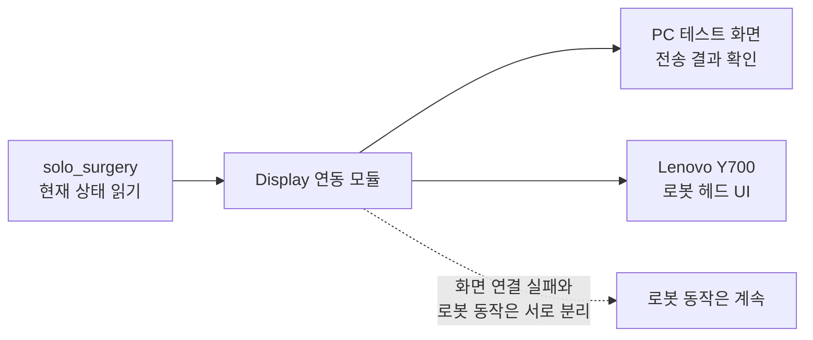

# Orchestra Surgical Display Integration

## Public pages

- [현장 Display Console](https://freeskyes.github.io/orchestra/)
- [Surgical Display API](https://freeskyES.github.io/orchestra-surgical-display-integration/api/)

`solo_surgery`의 현재 로봇 상태를 Lenovo Y700 헤드 화면으로 보내는 Python 연동 코드입니다.
Lenovo가 없어도 PC에서 먼저 전송 결과를 확인할 수 있는 테스트 서버를 함께 제공합니다.

## 가장 간단한 연동

일반 State는 `state` 하나만 보내면 됩니다.

```bash
curl -X POST http://10.77.0.11:8080/api/v1/state \
  -H 'Content-Type: application/json' \
  -d '{"state":"COMMAND_READY"}'
```

방향이나 음성 인식 결과가 화면에 필요할 때만 추가 정보를 붙입니다.

```json
{
  "state": "MANUAL_MOVING",
  "payload": {
    "direction": "cam_left"
  }
}
```

`robot_id`, 이벤트 ID, 세션, 순번, 전송 시간과 중요도는 태블릿이 자동 생성합니다. Python 연동 코드를 사용해도 개발자는 아래처럼 State와 필요한 추가 정보만 전달하면 되고, 나머지는 연동 코드가 자동 생성합니다.

```python
from orchestra_surgical_display import SurgicalDisplayClient

display = SurgicalDisplayClient("http://10.77.0.11:8080")
display.state("COMMAND_READY")
display.state("MANUAL_MOVING", direction="cam_left")
display.close()
```

전체 필드가 보이는 `POST /api/v1/events`는 Python 연동 코드가 내부적으로 사용합니다. 일반 연동에서 직접 호출할 필요가 없습니다.

## 한눈에 보기



화면 전송은 로봇 동작과 별도로 처리합니다. Lenovo가 꺼지거나 Wi-Fi가 끊겨도 로봇 동작은 중단되거나 바뀌지 않아야 합니다.

## 설치

- Python 3.10 이상
- 외부 런타임 패키지 없음

```bash
git clone https://github.com/freeskyES/orchestra-surgical-display-integration.git
cd orchestra-surgical-display-integration
python3 -m venv .venv
source .venv/bin/activate
python3 -m pip install -e .
```

## Lenovo 없이 2분 확인

첫 번째 터미널에서 로컬 수신 서버를 실행합니다.

```bash
python3 -m orchestra_surgical_display.simulator
```

두 번째 터미널에서 데모 State를 전송합니다.

```bash
python3 examples/send_demo.py
```

브라우저에서 <http://127.0.0.1:8080/admin>을 열면 State, 인식 문장, 방향과 함께 보낸 값이 표시됩니다.

단일 State만 보낼 수도 있습니다.

```bash
python3 examples/send_demo.py --state MANUAL_MOVING
python3 examples/send_demo.py --state ERROR
```

## 실제 로봇 연동

기존 로봇 동작 코드는 바꾸지 않고, 아래 상태 조회 함수의 값을 읽어 Display로 보냅니다.

- `controller.loop_status()`
- `coordinator.arm_state()`
- `servo.is_enabled()`

다음 환경 변수에 Lenovo Display 주소와 상태 확인 주기를 설정합니다.

```bash
export ORCHESTRA_SURGICAL_DISPLAY_URL=http://10.77.0.11:8080
export ORCHESTRA_SURGICAL_DISPLAY_POLL_SECONDS=0.1
```

```python
from orchestra_surgical_display import start_runtime_observer_from_env

display_observer = start_runtime_observer_from_env(
    controller=controller,
    servo=servo,
    coordinator=coordinator,
)
```

음성 인식 단계와 최종 결과도 같은 Display 연동 모듈에 전달합니다.

```python
if display_observer is not None:
    display_observer.set_voice_phase("VOICE: transcribing")
    display_observer.set_voice_result(
        result.intent.transcript,
        result.intent.action.value,
        executed=result.executed,
    )
```

프로그램을 종료할 때는 Display 연동 모듈을 먼저 종료합니다.

```python
if display_observer is not None:
    display_observer.stop()
```

Display 주소를 설정하지 않았거나 주소가 잘못되어도 로봇 프로그램은 그대로 시작되어야 합니다. 실제 코드 적용 위치와 확인 순서는 [연동 가이드](docs/INTEGRATION_GUIDE_KO.md)에 정리했습니다.

## State 계약

| 화면 의미 | 전송 State | 비고 |
|---|---|---|
| 시스템 준비 | `STARTING` | 시작 과정 |
| “시작” 명령 대기 | `AWAITING_START` | 세션 시작 전 |
| 명령 대기 | `COMMAND_READY` | 별도 READY 이벤트가 없어 연동 모듈이 계산 |
| 3축 수동 이동 | `MANUAL_MOVING` | 방향·배율은 추가 정보로 전송 |
| Visual Servoing | `VISUAL_SERVOING` | 실제 시각 추종 |
| 준비 위치 복귀 | `RETURNING` | `voice_ready` 동작 |
| 담당자 확인 | `ERROR` | 정규화 오류 코드만 전송 |

다음 3개는 기존 신호를 잃지 않기 위한 수신 호환 State입니다.

| 호환 State | 현재 화면 매핑 |
|---|---|
| `PEDAL_MOVING` | `MANUAL_MOVING` |
| `HOLDING` | `COMMAND_READY` |
| `PROTECTIVE_RECOVERY` | `COMMAND_READY` |

원본 State는 태블릿 진단 데이터에 유지하고 화면 표시 단계에서만 변환합니다. 전체 목록과 enum은 [`contract/states.json`](contract/states.json), HTTP 명세는 [`contract/openapi.yaml`](contract/openapi.yaml)을 기준으로 합니다.

## 개발자가 직접 정하는 값

| 값 | 언제 보내나요? | 필수 여부 |
|---|---|---|
| `state` | 화면 상태가 바뀔 때 | 항상 필수 |
| `direction` | `MANUAL_MOVING`의 6방향을 보여줄 때 | 해당 상태에서만 |
| `direction_scale` | 1배가 아닌 이동 배율을 보여줄 때 | 선택 |
| 음성 인식 값 | 듣기·인식 성공·실패 화면을 보여줄 때 | 해당 단계에서만 |
| `visual_phase` | Visual Servoing의 추적·대상 유실 등을 구분할 때 | 선택 |
| `safety_reason_code` | `ERROR`의 확인 코드를 보여줄 때 | 선택 |

UUID, 세션 ID, 순번, 시간, 중요도, 연결 확인 신호는 직접 만들지 않습니다.

## 음성 인식 결과 보내기

음성 인식 단계와 결과는 로봇 State와 함께 아래 항목으로 보냅니다.

```json
{
  "voice_phase": "complete",
  "recognized_text": "왼쪽",
  "recognition_result": "recognized",
  "command_action": "CAMERA_LEFT",
  "command_result": "accepted"
}
```

못 알아들은 경우에는 `recognition_result=unrecognized`, `command_result=rejected`로 전송합니다. `recognized_text`에는 화면에 잠깐 보여줄 최종 문장만 최대 80자로 넣습니다. 녹음된 음성 파일과 인식 중간 문장은 보내지 않습니다.

## 꼭 지켜야 할 사항

- 100 Hz·500 Hz 실시간 제어 함수 안에서는 화면 전송 함수를 호출하지 않습니다.
- 전송이 밀리면 오래된 화면 정보보다 최신 상태를 먼저 보냅니다.
- 연결 확인 신호는 자동으로 보내며 화면 State 이력을 불필요하게 늘리지 않습니다.
- 내부 오류 문장 전체 대신 약속된 `safety_reason_code`만 보냅니다.

API 필드와 응답 예시는 [API 계약 문서](docs/API_CONTRACT_KO.md)를 확인하세요. 공개 Swagger 문서는 <https://freeskyes.github.io/orchestra-surgical-display-integration/api/>에서 볼 수 있습니다.

## 테스트

```bash
PYTHONPATH=src python3 -m unittest discover -s tests -p 'test_*.py' -v
python3 -m compileall -q src examples tests
```

실제 Android API와 화면 소스: <https://github.com/freeskyES/orchestra-surgical-display>
